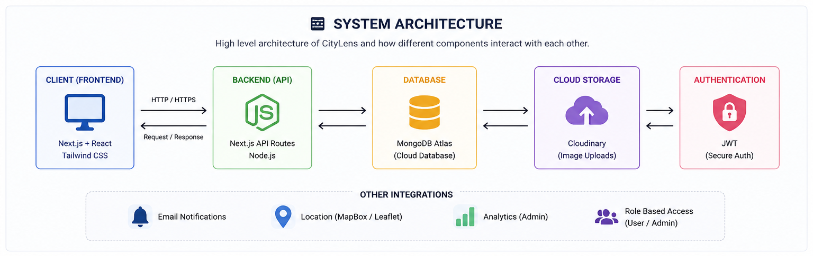
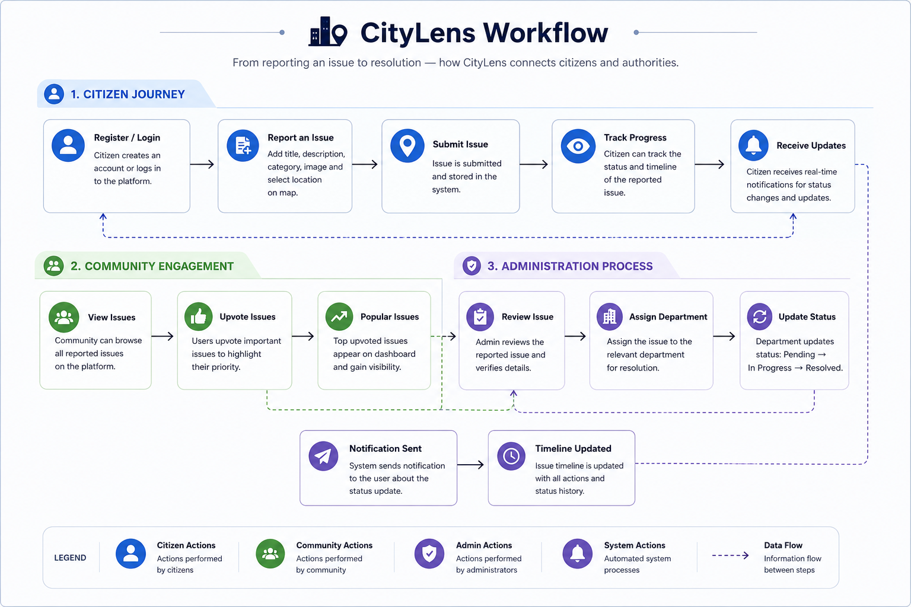
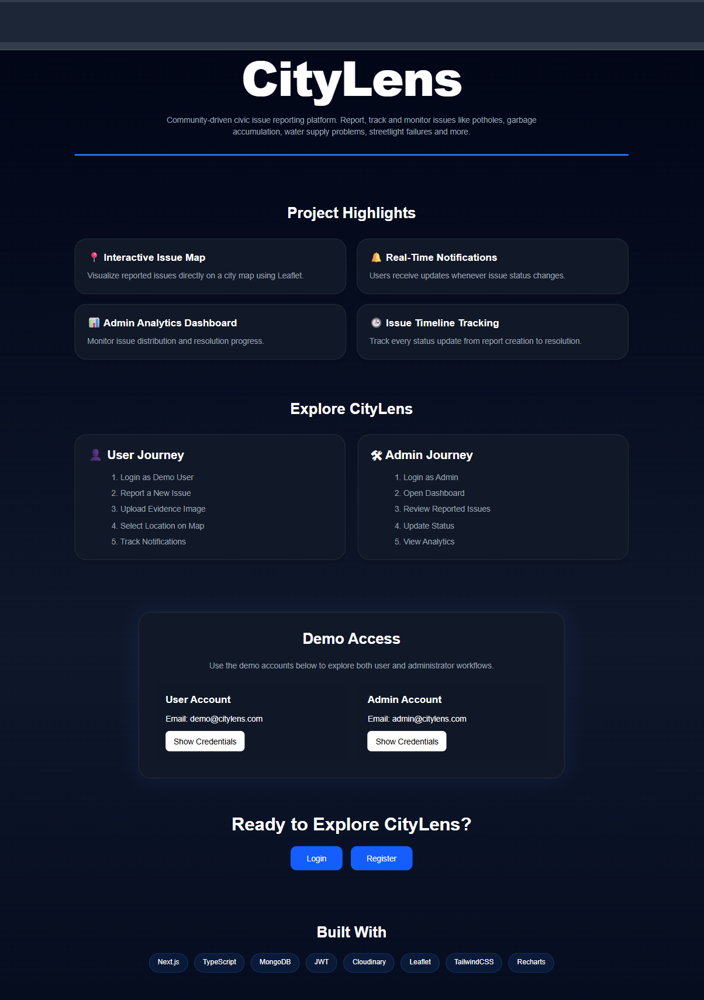
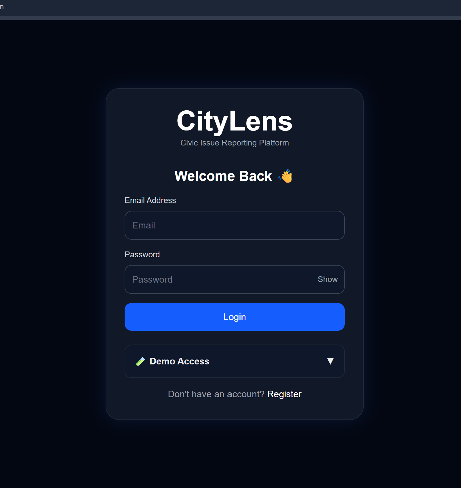
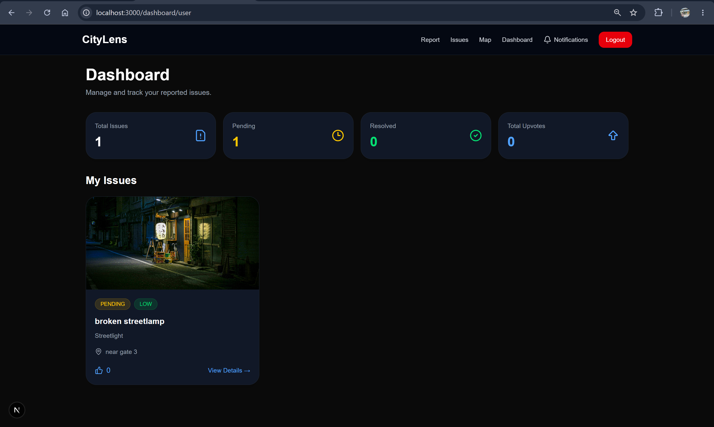
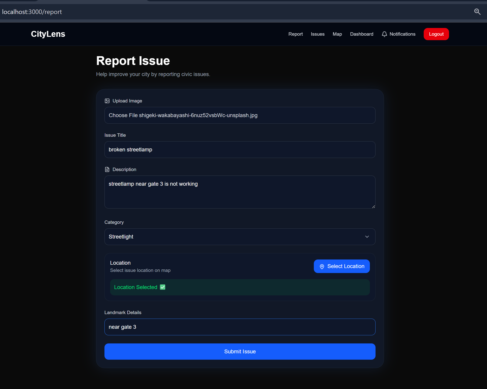
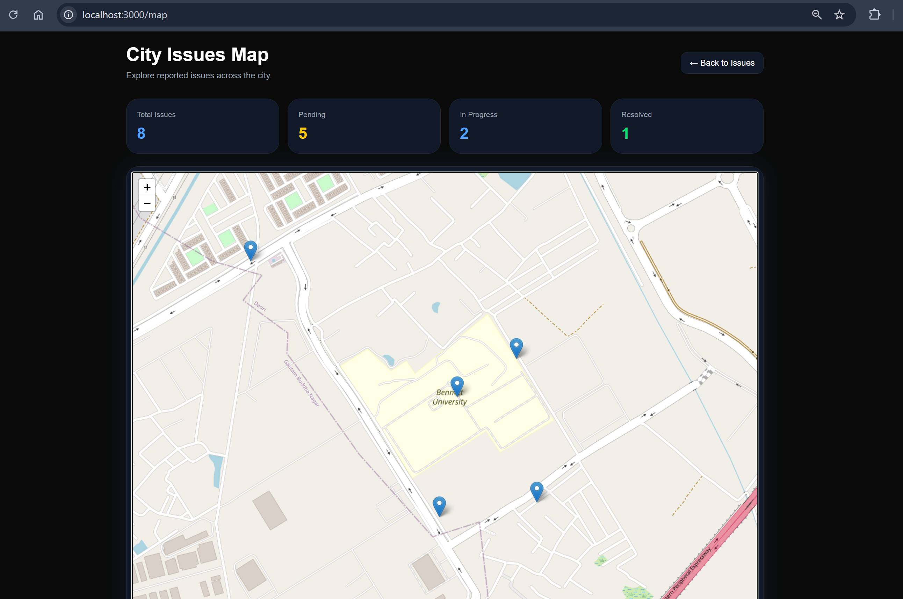
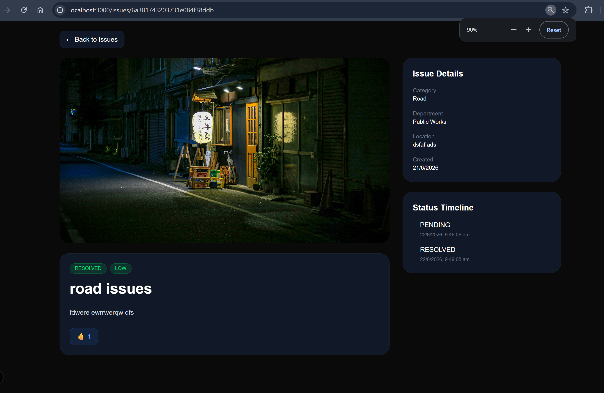
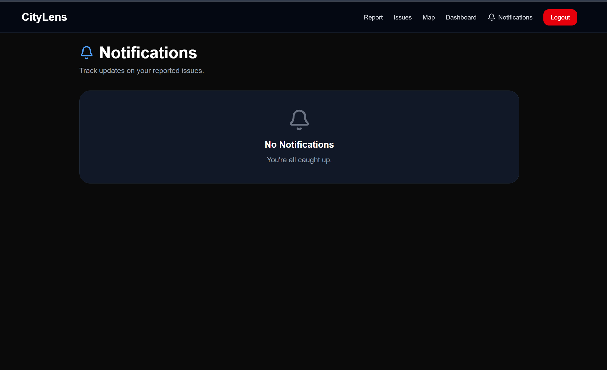
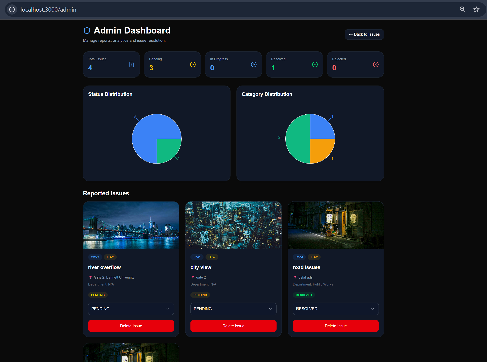

# 🏙️ CityLens - Civic Issue Reporting Platform

A modern civic issue management platform that enables citizens to report, track, and monitor city infrastructure problems while helping administrators efficiently manage and resolve them.

---

## 🚀 Overview

CityLens bridges the gap between citizens and city authorities by providing a centralized platform for reporting and tracking civic issues such as:

* Road damage & potholes
* Garbage accumulation
* Water supply issues
* Streetlight failures
* Electrical infrastructure problems
* Public maintenance concerns

Citizens can submit reports with images and precise map locations, while administrators can manage issues, update statuses, analyze trends, and notify users about progress.

---

## ✨ Key Features

### 👥 Citizen Features

* Secure Authentication (JWT)
* Report Issues with Images
* Interactive Map Location Selection
* Track Report Status
* Community Upvoting System
* Issue Timeline Tracking
* Real-Time Notifications
* Personal Dashboard

### 🛠️ Administration Features

* Admin Dashboard
* Status Management
* Department Assignment
* Issue Analytics
* Category Insights
* Community Issue Monitoring
* Notification Management

### 🌍 Platform Features

* Cloud Image Storage
* Interactive Maps
* Mobile Responsive Design
* Dark SaaS-Inspired UI
* Role-Based Access Control
* Issue History Tracking

---

## 🏗️ System Architecture



---

## 🔄 Workflow



### Reporting Workflow

1. User registers or logs in.
2. User submits an issue with description, image, and location.
3. Issue is stored in MongoDB.
4. Community users can view and upvote issues.
5. Admin reviews the issue.
6. Admin updates issue status.
7. Notification is generated.
8. User receives status updates.
9. Timeline is automatically updated.

---

## 🖼️ Screenshots

<details>
<summary>Click to View Screenshots ▼</summary>

### Landing Page



### Login Page



### User Dashboard



### Report Issue



### Interactive Map



### Issue Details



### Notifications



### Admin Dashboard


</details>

---

## 🛠️ Tech Stack

### Frontend

<p align="left">
  
</p>

### Backend & Database

<p align="left">
  
</p>

### Tools & Deployment

<p align="left">
  
</p>

### Additional Technologies

- 🔐 JWT Authentication
- ☁️ Cloudinary Image Storage
- 🗺️ Leaflet Maps
- 📊 Recharts Analytics

---

## 📂 Project Structure

```bash
app/
├── admin/
├── dashboard/
├── issues/
├── map/
├── notifications/
├── report/
├── login/
├── register/

components/
├── Navbar
├── IssueCard
├── AdminCharts
├── UpvoteButton

lib/
models/
```

## 🔐 Environment Variables

Create a `.env` file:

```env
MONGODB_URI=

JWT_SECRET=

CLOUDINARY_CLOUD_NAME=

CLOUDINARY_API_KEY=

CLOUDINARY_API_SECRET=
```

---

## ⚙️ Local Setup

Clone repository:

```bash
git clone https://github.com/Shivamsharma9425/citylens.git
```

Install dependencies:

```bash
npm install
```

Run development server:

```bash
npm run dev
```

Open:

```text
http://localhost:3000
```

---

## 🎯 Future Improvements

* Department Management Portal
* Email Notifications
* Heatmap Visualization
* Advanced Analytics
* Issue Escalation System
* Public Leaderboard
* PWA Support

---

## 👨‍💻 Author

**Shivam Sharma**

Built as a full-stack civic issue management system using Next.js, MongoDB, Cloudinary, Leaflet, and Tailwind CSS.
